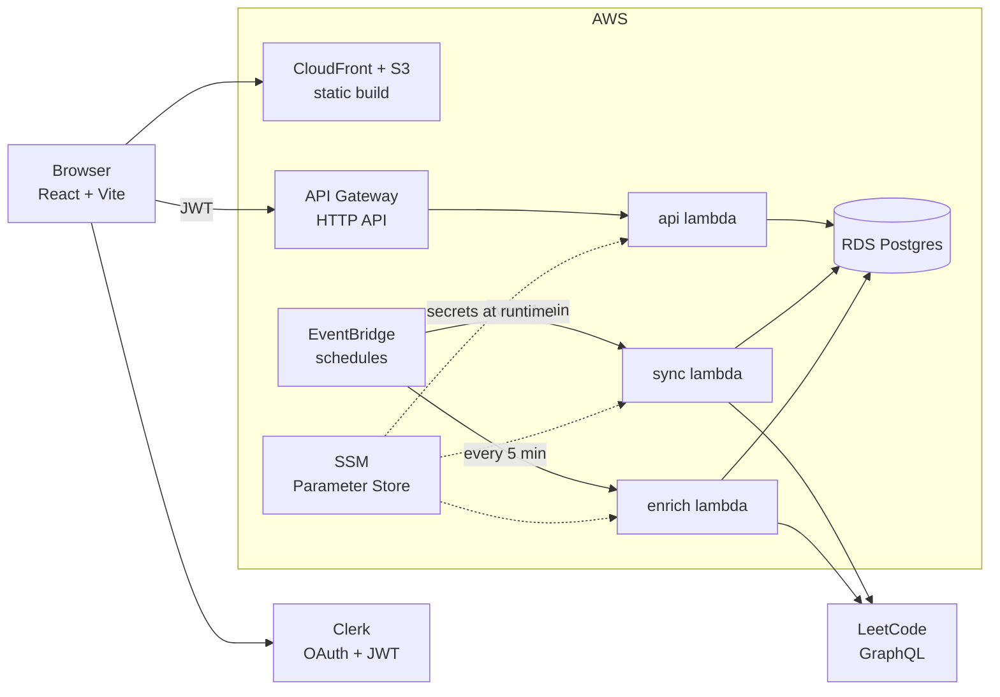

# Kronos

[](https://github.com/sah-rohan/leetcode-dashboard/actions/workflows/ci.yml)

**Live at [usekronos.tech](https://usekronos.tech)**

An upskilling ecosystem for the software engineering grind — LeetCode practice, system
design, and cloud fundamentals in one place, with your friends there to keep you sharp.
Link your LeetCode account and Kronos picks up new solves within the minute, turning 
them into progress rings, streaks, and a leaderboard you'd rather not be sitting at the bottom of.


## Features

**Interview prep**

- Roadmaps — Blind 75, NeetCode 150, NeetCode 250, or every problem
- Progress broken down by category and by difficulty
- Automatic LeetCode sync, plus a manual re-sync
- Solutions viewer with runtime, the submitted code, and an optimal-solution tag

**Study modules**

- System Design problems with a drag-and-drop design canvas
- GenAI system design — designing LLM and generative-AI systems piece by piece
- Main components reference — the reusable building blocks and when to reach for
  each
- Cloud engineering — AWS and Azure services side by side
- Networking curriculum — packets through VPCs, security groups, and the edge

**Community**

- Group leaderboard, scoped by roadmap, with a difficulty breakdown
- Daily streaks and a calendar, backfilled from LeetCode timestamps
- Recent activity feed across the group
- Friends — requests, accept/decline, side-by-side progress, and a friend's
  solutions

**Account & admin**

- Clerk OAuth sign-in behind an admin approval gate
- Username change requests
- Light and dark themes
- Admin tools — approve pending members, rename users, view analytics, rotate
  the LeetCode session cookie

## Architecture



Three Go lambdas share one codebase. `api` serves the dashboard, `sync` polls
for new solves, and `enrich` backfills solution detail. None of them hold
secrets — their environment carries SSM *parameter names*, and each reads the
values at runtime, so rotating a credential needs no redeploy.

| Layer | |
|---|---|
| Frontend | React 19 + TypeScript, React Router 7, Vite, Tailwind v4, Vitest |
| Auth | Clerk (OAuth, with admin approval) |
| Backend | Go on AWS Lambda (`provided.al2023`, arm64) |
| Data | RDS Postgres via pgx |
| Infra | Terraform — API Gateway HTTP API, EventBridge, S3 + CloudFront |
| CI/CD | GitHub Actions, OIDC to AWS, secrets in SSM Parameter Store |

## Prerequisites

| Tool | Version | Needed for |
|---|---|---|
| Node | 20.19+ or 22.12+ | frontend (CI runs Node 20) |
| Go | 1.23 | backend lambdas |
| Terraform | 1.x | infrastructure, deploy only |

> **Node 22.8 will not do.** If `npm run build` prints
> `You are using Node.js 22.8.0. Vite requires Node.js version 20.19+ or 22.12+`,
> you're in the gap between the two supported ranges. The build still completes,
> but it's an unsupported combination — move to 22.12+ or drop back to 20.19+.

## Run locally

The frontend runs standalone on canned fixtures — no backend, no Clerk account —
which is enough for most UI work. Create `.env.local` (git-ignored) with:

```
VITE_FIXTURES=1
```

```bash
npm install
npm run dev
```

Without either `VITE_FIXTURES=1` or an API URL the app has nothing to read, and
every screen lands on the "Couldn't load your data" card.

| Variable | Effect |
|---|---|
| `VITE_API_URL` | Base URL of the HTTP API. |
| `VITE_CLERK_PUBLISHABLE_KEY` | Clerk key. Unset → auth is skipped entirely. |
| `VITE_FIXTURES` | `1` → serve `src/dev/fixtures.ts` instead of calling the API. Dev server only; ignored in a production build. |

For the Go side — sync engine, seed generation, live verification against a real
LeetCode user — see [`backend/README.md`](backend/README.md).

## Scripts

| Command | Does |
|---|---|
| `npm run dev` | Vite dev server with HMR |
| `npm run build` | `tsc -b` then production build to `dist/` |
| `npm run lint` | ESLint |
| `npm run test` | Vitest, one pass |
| `npm run test:watch` | Vitest in watch mode |
| `npm run preview` | Serve the built `dist/` |

## API surface

One lambda behind API Gateway, routed by path prefix. Every request carries a
Clerk JWT; unapproved members get `403` outside a small pre-approval allowlist,
and `/admin/*` requires the admin flag.

```
/me/*           profile, progress, calendar, streak, sync, theme, username
/leaderboard    group ranking       /group/difficulty   /recent   /users
/friends/*      list, requests, accept, decline
/sd/*           system-design progress and activity
/admin/*        pending, approve, users, analytics, leetcode-session
```

## How syncing works

An EventBridge rule polls due members once a minute. The accepted-submission
count acts as a cheap delta guard — zero means back off, a small delta is
captured whole, a burst is flagged for confirmation. A second rule enriches
solutions (runtime, code, optimality) every five minutes using an authenticated
session. Details and the delta table are in
[`backend/README.md`](backend/README.md).

## Deploy

Pushing to `main` builds the lambdas, applies Terraform, loads the schema, and
publishes the frontend. AWS auth is keyless via GitHub OIDC. Full one-time setup
— state bucket, Parameter Store entries, OIDC role, Clerk config — is in
[`DEPLOY.md`](DEPLOY.md). The deploy run logs print the live site URL.

## Links

| | |
|---|---|
| Live site | <https://usekronos.tech> |
| Repository | <https://github.com/sah-rohan/leetcode-dashboard> |

## License

No `LICENSE` file is present, so the default applies: all rights reserved by the
repository owners. Add one if you intend to make the project reusable.
